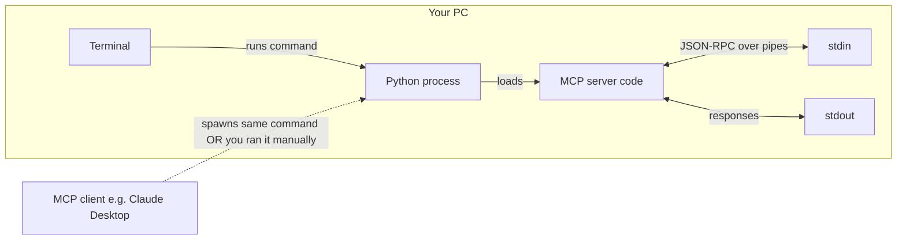
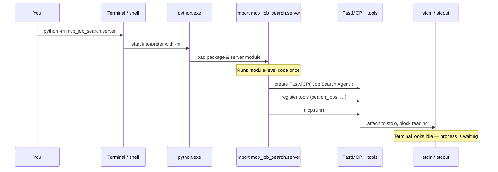
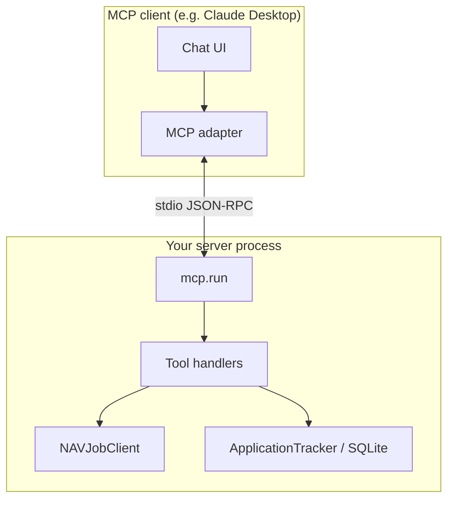

# What happens when you run `python -m mcp_job_search.server`

This document is a **visual map** of the process: what starts, what waits, and how a client fits in.

---

## 1. Big picture



When **you** run the command in a terminal, there is **no client** on the right yet — the server just **waits** on stdin. When **Claude Desktop** (or Cursor) is configured, **it** spawns this command and becomes the thing talking on stdin/stdout.

---

## 2. Startup sequence (inside Python)



**Module-level work** (simplified): imports, `FastMCP(...)`, global `nav_client` and `tracker`, `@mcp.tool()` registrations, then `main()` → `mcp.run()`.

---

## 3. Process vs. terminal (what you see)

```text
┌─────────────────────────────────────────────────────────────┐
  Terminal window                                              │
┌─────────────────────────────────────────────────────────────┐
│ (.venv) PS D:\...\Job-Agent> python -m mcp_job_search.server │
│                                                              │
│  ▌  ← cursor here, no new prompt                             │
│                                                              │
│  (Often almost no printed lines — logging may be quiet)      │
└─────────────────────────────────────────────────────────────┘
                              │
                              │ same OS process
                              ▼
┌─────────────────────────────────────────────────────────────┐
  python.exe                                                   │
  ┌─────────────────────────────────────────────────────────┐   │
  │ FastMCP loop: read stdin → handle JSON-RPC → write out   │   │
  │ Blocked until a line/message arrives OR Ctrl+C           │   │
  └─────────────────────────────────────────────────────────┘   │
└─────────────────────────────────────────────────────────────┘
```

- **No GUI** — nothing opens a window.
- **No HTTP page** — unless you add that separately later.
- **Ctrl+C** stops the process and returns the shell prompt.

---

## 4. When an MCP client is connected



Example flow when you ask Claude to search jobs:

```text
You type in Claude  →  Claude decides to call tool "search_jobs"
                    →  Client sends JSON-RPC over child's stdin
                    →  Your server runs async search_jobs(...)
                    →  Result string goes back on stdout
                    →  Claude shows you the formatted job list
```

---

## 5. One-line summary

| Step | What happens |
|------|----------------|
| 1 | Shell starts `python` with module `mcp_job_search.server`. |
| 2 | Python imports the package, builds `FastMCP`, registers tools. |
| 3 | `mcp.run()` **blocks**, reading/writing **stdio** (MCP protocol). |
| 4 | Terminal looks **empty or frozen** — the program is **waiting**, not crashed. |
| 5 | **With a client**, messages flow on stdin/stdout; **alone**, nothing arrives until you press **Ctrl+C**. |

---

## 6. Related commands (contrast)

| Command | Typical outcome |
|---------|-------------------|
| `python -m pytest` | Runs tests, prints dots, **exits** with prompt. |
| `python -m mcp_job_search.server` | Starts long-lived server, **does not exit** until Ctrl+C. |

This file is for learning; it is not required to run the server.
